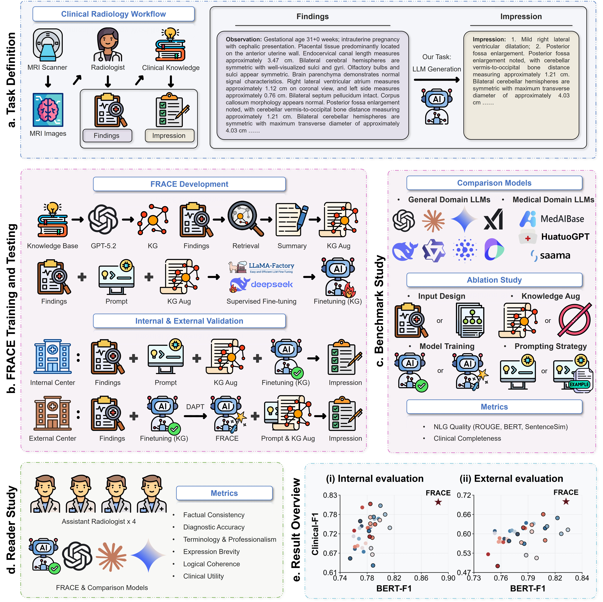

# KG-Enhanced LLM for Fetal Brain MRI Diagnosis with Domain Adaptation

This repository provides the implementation for our paper on leveraging Large Language Models (LLMs) enhanced with clinical Knowledge Graphs (KG) and Domain-Adaptive Pre-Training (DAPT) for automated fetal brain MRI diagnostic report generation.

## Overview

Automated generation of fetal brain MRI diagnostic reports is challenging due to the complexity of clinical findings, the need for domain-specific knowledge, and the distribution shift across different medical centers. We propose a three-stage framework built upon DeepSeek-R1-Qwen3-8B:

1. **Direct Supervised Fine-Tuning (SFT)**: LoRA-based fine-tuning on in-distribution diagnostic data as the baseline.
2. **Knowledge Graph-Enhanced Fine-Tuning**: A clinical KG retrieval module that augments training inputs with structured medical knowledge (measurement thresholds, finding interpretations, differential diagnoses).
3. **Domain-Adaptive Pre-Training (DAPT)**: Unsupervised continual pre-training on unlabeled out-of-distribution (OoD) target-domain text with experience replay, improving cross-center generalization.



## Key Innovations

- **Clinical Knowledge Graph with Dual-Path Retrieval**: A domain-specific KG for fetal brain MRI that combines (A) numeric rule-based extraction with threshold grading for quantitative measurements (e.g., lateral ventricle width), and (B) concept-level graph traversal for qualitative findings (e.g., corpus callosum agenesis), providing structured clinical references to guide LLM reasoning.

- **KG-Augmented Training Paradigm**: Instead of modifying the model architecture, we augment the training input with retrieved KG context at the data level, enabling the model to learn the association between imaging findings and clinical knowledge without additional inference overhead.

- **DAPT with Experience Replay for OoD Generalization**: A lightweight domain adaptation strategy that performs continual pre-training on unlabeled target-domain reports (input field only, preserving the unsupervised setting) with a small proportion of source-domain replay to mitigate catastrophic forgetting.

- **Multi-Dimensional Evaluation Framework**: Combining NLP metrics (ROUGE-L, BERTScore, Sentence Similarity) with LLM-as-judge evaluation (keyword extraction + TP/FP/FN comparison) for comprehensive and clinically meaningful assessment.

## Repository Structure

```
.
├── README.md
├── requirements.txt
├── fig1.jpg
├── direct_finetuning/          # Stage 1: Direct SFT
│   ├── train.yaml              # LLaMA-Factory training config
│   ├── predict.yaml            # LLaMA-Factory inference config
│   └── dataset_info.json       # Dataset registration for LLaMA-Factory
├── kg_enhanced_finetuning/     # Stage 2: KG-Enhanced SFT
│   ├── configs/
│   │   ├── train_kg.yaml       # Training config (KG-augmented data)
│   │   └── predict_kg.yaml     # Inference config
│   └── kg_rag/                 # KG retrieval module
│       ├── __init__.py
│       ├── clinical_kg.json    # Clinical Knowledge Graph (entities + triples)
│       ├── kg_loader.py        # KG loader with index construction
│       ├── preprocessor.py     # Text normalization and sentence splitting
│       ├── numeric_extractor.py # Path A: Numeric measurement extraction & threshold grading
│       ├── graph_retriever.py  # Path B: Concept matching & knowledge traversal
│       ├── verbalizer.py       # Natural language generation from structured results
│       ├── context_builder.py  # Top-level orchestration (Path A + B)
│       ├── dataset_builder.py  # Augmented dataset construction
│       ├── coverage_stats.py   # KG coverage statistics
│       └── run_build.py        # Entry script for dataset building
└── dapt/                       # Stage 3: Domain-Adaptive Pre-Training
    ├── configs/
    │   ├── v1_center1_dapt.yaml      # DAPT config: direct SFT + center1
    │   ├── v1_center2_dapt.yaml      # DAPT config: direct SFT + center2
    │   ├── v2_kg_center1_dapt.yaml   # DAPT config: KG-enhanced + center1
    │   └── v2_kg_center2_dapt.yaml   # DAPT config: KG-enhanced + center2
    └── scripts/
        ├── step0_extract_ood_text.py           # Extract unlabeled OoD text
        ├── step1_build_pt_corpus.py            # Build DAPT corpus (with optional replay)
        ├── step2_train_dapt.bash               # Batch DAPT training
        ├── step3_predict.bash                  # Batch prediction (SFT-only / SFT+DAPT)
        ├── step4_postprocess.bash              # Full evaluation pipeline
        ├── step4-1_text_extract_and_clean.py   # Post-processing: text extraction & cleaning
        ├── step4-2_evaluate_output_with_metrics.py  # NLP metrics (ROUGE-L, BERTScore, SentSim)
        ├── step4-3_evaluate_outputs_with_llm_part1.py  # LLM keyword extraction
        ├── step4-3_evaluate_outputs_with_llm_part2.py  # LLM TP/FP/FN comparison
        └── step4-4_get_statistics_with_metrics.py      # Aggregate statistics
```

## Requirements

- Python >= 3.10
- CUDA >= 11.8
- GPU: NVIDIA A100/H100 (40GB+ VRAM recommended)

Install dependencies:

```bash
pip install -r requirements.txt
```

The training and inference pipeline is built on [LLaMA-Factory](https://github.com/hiyouga/LLaMA-Factory). Please install it following the official instructions:

```bash
git clone https://github.com/hiyouga/LLaMA-Factory.git
cd LLaMA-Factory
pip install -e ".[torch,metrics]"
```

Base model: [DeepSeek-R1-0528-Qwen3-8B](https://huggingface.co/deepseek-ai/DeepSeek-R1-0528-Qwen3-8B)

## Data Privacy

Due to patient privacy and institutional data regulations, the training and evaluation datasets (fetal brain MRI diagnostic reports) cannot be publicly released. We provide:
- All training/inference configuration files
- The clinical knowledge graph (`kg_rag/clinical_kg.json`)
- Complete code for data processing, model training, inference, and evaluation

Users can apply the same pipeline to their own institutional data by following the data format specified in `dataset_info.json`.

## Usage

### Stage 1: Direct Supervised Fine-Tuning

```bash
cd direct_finetuning

# Prepare your dataset in LLaMA-Factory format and register in dataset_info.json
# Each sample: {"instruction": "...", "input": "<report>", "output": "<diagnosis>", "system": "..."}

# Training
CUDA_VISIBLE_DEVICES=0 llamafactory-cli train train.yaml

# Inference
CUDA_VISIBLE_DEVICES=0 llamafactory-cli train predict.yaml
```

### Stage 2: KG-Enhanced Fine-Tuning

```bash
cd kg_enhanced_finetuning

# Step 1: Build KG-augmented training data
python kg_rag/run_build.py \
    --input_path /path/to/InDistribution_train.json \
    --output_path ./data/InDistribution_train_with_kg.json \
    --kg_path kg_rag/clinical_kg.json \
    --stats

# Step 2: Register augmented dataset in data/dataset_info.json, then train
CUDA_VISIBLE_DEVICES=0 llamafactory-cli train configs/train_kg.yaml

# Step 3: Inference
CUDA_VISIBLE_DEVICES=0 llamafactory-cli train configs/predict_kg.yaml
```

### Stage 3: Domain-Adaptive Pre-Training (DAPT)

```bash
cd dapt

# Step 0: Extract unlabeled text from OoD datasets (input field only)
python scripts/step0_extract_ood_text.py \
    --dataset_dir /path/to/dataset \
    --output_dir ./data

# Step 1: Build DAPT pre-training corpus
python scripts/step1_build_pt_corpus.py --data_dir ./data
# For ablation with replay:
python scripts/step1_build_pt_corpus.py --data_dir ./data --replay 0.006

# Step 2: Run DAPT training
CUDA_VISIBLE_DEVICES=0 bash scripts/step2_train_dapt.bash

# Step 3: Prediction (SFT-only and SFT+DAPT modes)
CUDA_VISIBLE_DEVICES=0 bash scripts/step3_predict.bash all all

# Step 4: Evaluation pipeline
CUDA_VISIBLE_DEVICES=0 bash scripts/step4_postprocess.bash
```

### Evaluation

The evaluation pipeline (`step4_postprocess.bash`) runs four stages:
1. **Text extraction & cleaning**: Extract predictions, remove think tags, normalize text
2. **NLP metrics**: ROUGE-L (Chinese), BERTScore, Sentence Similarity
3. **LLM-based evaluation**: Keyword extraction and TP/FP/FN comparison using GPT-4o
4. **Statistics aggregation**: Generate per-dataset and per-center comparison tables

Set `OPENAI_API_KEY` and `OPENAI_BASE_URL` environment variables for LLM-based evaluation.

## Citation

```bibtex
@article{,
  title={},
  author={},
  journal={},
  year={}
}
```

## License

This project is for research purposes only. The clinical knowledge graph and evaluation prompts are designed specifically for fetal brain MRI diagnosis.
